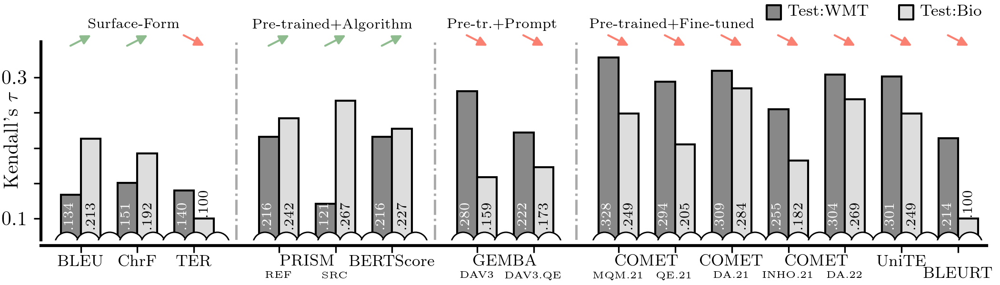
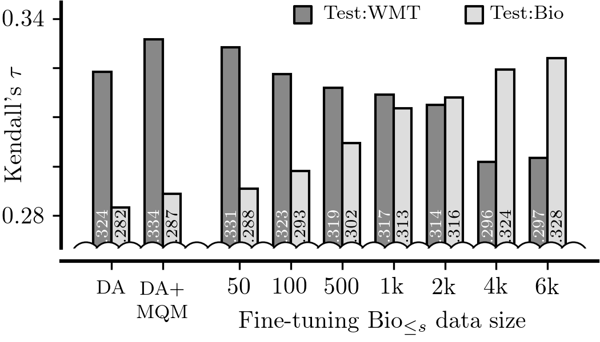
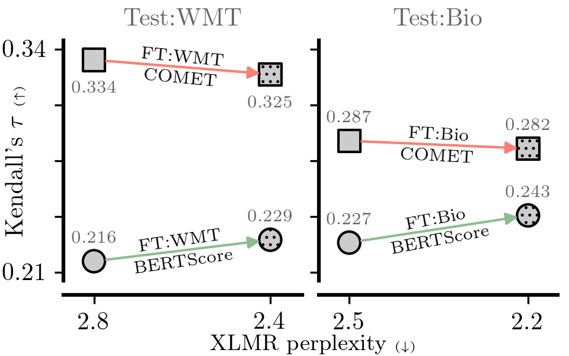
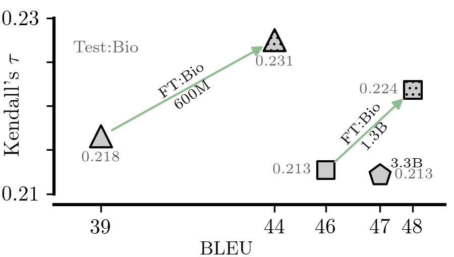

# Biomedical MQM Dataset

Dataset and codebase for *Fine-Tuned Machine Translation Metrics Struggle in Unseen Domains*.

> We introduce a new, extensive multidimensional quality metrics (MQM) annotated dataset covering 11 language pairs in the biomedical domain. 
> We use this dataset to investigate whether machine translation (MT) metrics which are fine-tuned on human-generated MT quality judgements are robust to domain shifts between training and inference. 
> We find that fine-tuned metrics exhibit a substantial performance drop in the unseen domain scenario relative to metrics that rely on the surface form, as well as pre-trained metrics which are not fine-tuned on MT quality judgments. 

## New Dataset

The dataset is based on system submissions from 21 participants to the WMT21 bio translation shared task (Yeganova et al., 2021), which is in turn based on bilingual academic paper abstracts in the MEDLINE corpus retrieved from National Library of Medicine (NLM).
Reference translations and MQM annotations were created on top of the shared task dataset by expert linguists with experience in the medical domain.

The dataset can be accessed [here](https://github.com/amazon-science/bio-mqm-dataset/tree/main/data).

---

The rest of this README contains a brief guide on how to replicate the main figures and tables.

Note on project structure: most of code is in the `metrics_domain_adaptation/scripts` folder with individual subdirectories corresponding to particular experiments.
An exception to this are the utility scripts and the metrics implementations (`metrics/`).
All of the scripts are intended to be run from the top-level directory `MetricsDomainAdaptation`.

If a script is intended to be run directly, it is marked as executable and has an appropriate hashbang.
Furthermore, the training experiments assume that you have a GPU with at least 22G of memory (e.g. A10G).
The Prism training experiments require A100s.

## Important Prerequisites

1. Install packages below

```bash
conda create -n bioenv python=3.9
conda activate bioenv

pip install torch==2.1.2
pip install pytorch-lightning==1.9.5
pip install transformers==4.33.0
pip install numpy==1.26.3
pip install scikit-learn==1.4.0
pip install datasets==2.16.1
pip install mosestokenizer==1.2.1
pip install sacrebleu==2.4.0
pip install sacremoses==0.1.1
pip install rouge_score==0.1.2
pip install openai==1.9.0

# Comet
pip install git+https://github.com/shuoyangd/COMET.git@bio-mqm-exp
pip install accelerate==0.26.1
pip install tensorflow==2.15.0
pip install wandb==0.16.2

# Bertscore
pip install git+https://github.com/shuoyangd/bert_score.git@bio-mqm-exp
pip install biopython==1.83
pip install langdetect==1.0.9
pip install sentence_splitter==1.4
```

2. Set the `ADAPTATION_ROOT` environment variable to a path where most of your generated data and models will be stored. While you can set it to `.`, it is discouraged because then the top-level project directory will get messy.

## Setting Up Data for Result Reproduction

This is the most crucial and likely error-prone part.

1. Run `metrics_domain_adaptation/scripts/02-data/01a-get_general.sh; metrics_domain_adaptation/scripts/02-data/01b-process_general.py` to download and process mono and parallel data.
2. Run `metrics_domain_adaptation/scripts/02-data/02-get_da_general.py` to download and process DA data.
3. Create a simlink of the data in the working directory: `ln -s /path/to/bio-mqm-dataset/data/v1 ${ADAPTATION_ROOT}/data/raw/wmt21-biomed-mqm/`.
4. Run `metrics_domain_adaptation/scripts/02-data/04a-get_mqm_bio.py; metrics_domain_adaptation/scripts/02-data/04b-split_mqm_bio.py` to process and split the Bio MQM data (also prints out summary statistics of error distribution for Bio). You can also run `metrics_domain_adaptation/scripts/02-data/04c-stats_mqm_bio.py` to generate an overview table with annotator and system counts.  By default this will skip reference MQM annotations. The test/dev splits are versioned in `data/doc_id_splits.json`.
5. Run `metrics_domain_adaptation/scripts/02-data/05a-get_mqm_general_raw.sh; metrics_domain_adaptation/scripts/02-data/05b-split_zscore_mqm_general.py` to download and process General MQM data. This may take some time. It also prints out summary statistics of error distribution for General.
6. Run `metrics_domain_adaptation/scripts/02-data/06-get_medline.py` to download and process Bio parallel data. This may take some time.
7. Run `metrics_domain_adaptation/scripts/02-data/07-get_mono_medical.py` to get Bio monolingual data.
8. Run `metrics_domain_adaptation/scripts/02-data/08-domain_dist.py` to compute the distribution within General domains.
9. Run `metrics_domain_adaptation/scripts/02-data/20-download_comet.sh` to get all the baseline COMET models.

You can then compute the counts for Table 2 using the following snippet.
You can do the same for the mono and parallel data but in Table 1 we report a lower number which is the result of balancing.
```bash
# main set, for testing
wc -l ${ADAPTATION_ROOT}/data/mqm/bio/test/*.jsonl
# secondary set, for dev and "train"
wc -l ${ADAPTATION_ROOT}/data/mqm/bio/dev/*.jsonl
# 2022 data, for testing
wc -l ${ADAPTATION_ROOT}/data/mqm/general/test/*.jsonl
# <2022 data, for training
wc -l ${ADAPTATION_ROOT}/data/mqm/general/train/*.jsonl
```

The outputs with the current data are:

```
$ wc -l ${ADAPTATION_ROOT}/data/mqm/bio/test/*.jsonl
    2456 data/mqm/bio/test/de-en.jsonl
    2694 data/mqm/bio/test/en-de.jsonl
    1111 data/mqm/bio/test/en-es.jsonl
    1227 data/mqm/bio/test/en-fr.jsonl
     824 data/mqm/bio/test/en-ru.jsonl
    3899 data/mqm/bio/test/en-zh.jsonl
    1012 data/mqm/bio/test/es-en.jsonl
    1107 data/mqm/bio/test/fr-en.jsonl
    1323 data/mqm/bio/test/ru-en.jsonl
    2837 data/mqm/bio/test/zh-en.jsonl
   19191 total

$ wc -l ${ADAPTATION_ROOT}/data/mqm/bio/dev/*.jsonl
    222 data/mqm/bio/dev/br-en.jsonl
    902 data/mqm/bio/dev/de-en.jsonl
    916 data/mqm/bio/dev/en-de.jsonl
    329 data/mqm/bio/dev/en-es.jsonl
    307 data/mqm/bio/dev/en-fr.jsonl
    236 data/mqm/bio/dev/en-ru.jsonl
   1199 data/mqm/bio/dev/en-zh.jsonl
    308 data/mqm/bio/dev/es-en.jsonl
    351 data/mqm/bio/dev/fr-en.jsonl
    387 data/mqm/bio/dev/ru-en.jsonl
    912 data/mqm/bio/dev/zh-en.jsonl
   6069 total

$ wc -l ${ADAPTATION_ROOT}/data/mqm/general/test/*.jsonl
   18301 mqm/general/test/en-de.jsonl
   18503 mqm/general/test/en-ru.jsonl
   23153 mqm/general/test/zh-en.jsonl
   59957 total
   ```

## Baseline Metric Evaluation

Run the following to get performance of baseline models:

```bash
mkdir -p ${ADAPTATION_ROOT}/computed/;
mkdir -p computed/;

for METRIC in "bleu" "chrf" "ter" "comet" "comet-qe" "comet-da" "cometinho" "comet22-da" "unite-mup" "bertscore" "bleurt" "unite" "prism2-src" "prism2-ref" "prism-src" "prism-ref"; do
    echo "Running $METRIC";
    ./metrics_domain_adaptation/run_metric.py --metric $METRIC | grep JSON | cut -c 6- >> ${ADAPTATION_ROOT}/computed/metrics_base.jsonl;
done;
```

Note that [Prism](https://github.com/thompsonb/prism) with the origional [m39v1](http://data.statmt.org/prism/m39v1.tar) model is not well integrated yet.
Using `--metric prism-src` and `--metric prism-ref` requires the `prism` directory to be on the same level as `MetricsDomainAdaptation`.
Prism with [NLLB](https://github.com/facebookresearch/fairseq/tree/nllb) models (`--metric prism2-src` and `--metric prism2-ref`) works fine out of the box.

In order to include GEMBA, you have to have generated scores in `${ADAPTATION_ROOT}/data/computed/gemba/`.
This can be done by first fetching the submodule (`git submodule update`) and invoking `metrics_domain_adaptation/scripts/10-gemba/gemba/main.py`.
However, before you do that, you must first put in your OpenAI API key in `metrics_domain_adaptation/scripts/10-gemba/gemba/secret.py` (replace the `*****`).
You can also obtain them by: `cp -r /efs/vzouhar/data/computed/gemba_v3/ ${ADAPTATION_ROOT}/data/computed/gemba`.
Then you can run the following:

```bash
# example how to use the GEMBA scores
for METRIC in "gemba-dav003" "gemba-qe-dav003"; do
    ./metrics_domain_adaptation/run_metric.py --metric $METRIC | grep JSON | cut -c 6- >> ${ADAPTATION_ROOT}/computed/metrics_base.jsonl;
done
```

After all this you should be able to run the following which generates Figure 2 in the paper:
```bash
# all figures are stored locally
mkdir -p computed/figures/
metrics_domain_adaptation/scripts/03-figures/01-domain_mismatch.py
metrics_domain_adaptation/scripts/03-figures/02-domain_mismatch_introsmall.py
# check that figure was generated
ls computed/figures_pdf/domain_mismatch.pdf computed/figures_pdf/domain_mismatch_small.pdf
```




## Adapting MQM

### Baseline DA and DA+MQM

Two baseline models need to be trained (on top of XLM-Roberta-Large): DA and DA+MQM.
The first one takes a long time (10hrs on A10G) because there is more DA data than MQM.
The model can be launched with the following (you may want to run with different `CUDA_VISIBLE_DEVICES`):

```bash
# output is ${ADAPTATION_ROOT}/models/trained/da/main/checkpoints/*.ckpt
metrics_domain_adaptation/05-adapt_mqm/01a-comet_da_from_scratch.sh
# output is ${ADAPTATION_ROOT}/models/trained/da/qe/checkpoints/*.ckpt
metrics_domain_adaptation/05-adapt_mqm/01c-cometqe_da_from_scratch.sh
```

After they are trained, you can launch the MQM training with:
```bash
# output is ${ADAPTATION_ROOT}/models/trained/mqm/main/checkpoints/*.ckpt
metrics_domain_adaptation/05-adapt_mqm/01b-comet_mqm_from_da.sh
# output is ${ADAPTATION_ROOT}/models/trained/mqm/qe/checkpoints/*.ckpt
metrics_domain_adaptation/05-adapt_mqm/01d-cometqe_mqm_from_da.sh
```

You also have to copy the special `hparams.yaml` file needed for training and inference later:
```bash
cp ${ADAPATATION_ROOT}/models/comet/wmt21-comet-mqm/hparams.yaml ${ADAPTATION_ROOT}/{da,mqm}/main/
cp ${ADAPATATION_ROOT}/models/comet/wmt21-comet-qe-mqm/hparams.yaml ${ADAPTATION_ROOT}/{da,mqm}/qe/
```

This on its own is not sufficient.
These two `hparams.yaml` are different and they always need to be put one level _above_ the actual model, i.e. on the same level as `checkpoints/`.

You can evaluate the models as a metric. Note that we avoid having to specify the full model file name because the glob evaluates to exactly one file.
```bash
for SUFFIX in "da/main/checkpoints/" "da/qe/checkpoints/" "mqm/main/checkpoints/" "mqm/qe/checkpoints/"; do
    ./metrics_domain_adaptation/run_metric.py --metric comet-ours --model-path ${ADAPTATION_ROOT}/models/trained/${SUFFIX}/*.ckpt \
        | grep JSON | cut -c 6-
done
```

### Finetuning on Bio

This subsection describes how to finetune existing MQM models on Bio data.

Run the following to launch finetuning of the MQM model (in parallel).
```bash
for SEED in 0 1 2 3 4 5 6 7; do
    CUDA_VISIBLE_DEVICES=${SEED} nohup ./metrics_domain_adaptation/scripts/05-adapt_mqm/04a-finetune_datasize_driver.sh ${SEED} &
done
```

The same can be done for the QE version:
```bash
for SEED in 0 1 2 3 4 5 6 7; do
    CUDA_VISIBLE_DEVICES=${SEED} nohup ./metrics_domain_adaptation/scripts/05-adapt_mqm/04a-finetune_datasize_driver.sh ${SEED} &
done
```

Alternatively you can individual combinations of seed and training Bio size as follows:
```bash
./metrics_domain_adaptation/scripts/05-adapt_mqm/03a-finetune_datasize.sh $BIO_COUNT $SEED;
./metrics_domain_adaptation/scripts/05-adapt_mqm/03b-finetune_datasize_qe.sh $BIO_COUNT $SEED;
```

Afterwards we need to copy the respective `hparams.yaml` files:
```bash
cp ${ADAPATATION_ROOT}/models/comet/wmt21-comet-mqm/hparams.yaml ${ADAPTATION_ROOT}/models/trained/finetune_datasize/
cp ${ADAPATATION_ROOT}/models/comet/wmt21-comet-qe-mqm/hparams.yaml ${ADAPTATION_ROOT}/models/trained/finetune_datasize_qe/
```

We can evaluate the newly trained models using the following script:
```bash
# mass-evaluate everything (the stars need to be in quotes)
./metrics_domain_adaptation/scripts/05-adapt_mqm/05a-finetune_datasize_eval.sh "*" "*";
./metrics_domain_adaptation/scripts/05-adapt_mqm/05b-finetune_datasize_eval_qe.sh "*" "*";

# or feel free to paralelize in the following way:
./metrics_domain_adaptation/scripts/05-adapt_mqm/05b-finetune_datasize_eval_qe.sh $BIO_COUNT $SEED;
```

After they are all evaluated, we can generate Figures 3 and 5:
```bash
# check that the eval logfiles exist, should be 348 lines
# NOTE: you may need to manually add DA and MQM+DA
wc -l ${ADAPTATION_ROOT}/computed/metrics_finetune_datasize.jsonl
wc -l ${ADAPTATION_ROOT}/computed/metrics_finetune_datasize_qe.jsonl

# run the plotting
./metrics_domain_adaptation/scripts/03-figures/03-adapt_mqm_finetune_datasize.py 
./metrics_domain_adaptation/scripts/03-figures/03-adapt_mqm_finetune_datasize.py --qe

# check figures exist
ls computed/figures_pdf/adapt_mqm_finetune_datasize{,_qe}.pdf
```



### Training with Mixed Bio and General

The mixed Bio+General training is fairly similar:
```bash
./metrics_domain_adaptation/scripts/05-adapt_mqm/10b-scratch_datasize_1ep.sh $BIO_COUNT $UPSAMPLE $SEED
```

The `$UPSAMPLE` factor needs to be reweighted. To this end you can run the following which generates a sequence of commands to run.
```bash
./metrics_domain_adaptation/scripts/05-adapt_mqm/11-scratch_datasize_find_k.py
```

Evaluation and plotting can be done in a similar fashion:
```bash
# the evaluation can be parametrized by replacing `"*"`
./metrics_domain_adaptation/scripts/05-adapt_mqm/12b-scratch_datasize_eval_1ep.sh "*" "*" "*";

# sanity check
wc -l ${ADAPTATION_ROOT}/computed/metrics_scratch_datasize_1ep.jsonl

# plots individual size
./metrics_domain_adaptation/scripts/03-figures/04-adapt_mqm_scratch_datasize.py --count 5500;
ls computed/figures_pdf/adapt_mqm_scratch_datasize_count6k.pdf

# aggreates all
for BIO_COUNT in 0 50 100 500 1000 2000 4000 5500; do
    DISPLAY="" ./metrics_domain_adaptation/scripts/03-figures/04-adapt_mqm_scratch_datasize.py --count $BIO_COUNT;
done | cut -c 6- > ${ADAPTATION_ROOT}/computed/agg_scratch_datasize_ep1.jsonl

# sanity check and generate another figure (not used in paper)
wc -l ${ADAPTATION_ROOT}/computed/agg_scratch_datasize_ep1.jsonl
./metrics_domain_adaptation/scripts/03-figures/05-adapt_mqm_scratch_datasize_aggregated.py
ls computed/figures_pdf/adapt_mqm_scratch_datasize_agg.pdf
```


### Infinite Training

For Figure 9, DA needs to be trained for up to 8 epochs and MQM for up to 16 epochs.
To do that, run:
```bash
# train all the models in sequence
# feel free to paralelize the trainings inside using `CUDA_VISIBLE_DEVICES=3 nohup ...command... &`
./metrics_domain_adaptation/scripts/07-culprit_da/10-train_xep.sh

# evaluate all models in sequence
# can be easily paralelized
./metrics_domain_adaptation/scripts/07-culprit_da/11-eval_xep.sh

# sanity check, should be 180
wc -l ${ADAPTATION_ROOT}/computed/metrics_dax_mqmx.jsonl

# get table
./metrics_domain_adaptation/scripts/03-figures/13-dax_mqmx_table.py
```

### Culprit DA

For Figure 8 run the following:
```bash
# generate subsampled data
metrics_domain_adaptation/scripts/07-culprit_da/01-generate_culprit_data.py

# train DA models (paralelize)
metrics_domain_adaptation/scripts/07-culprit_da/02-train_da.sh
# train MQM models (paralelize)
metrics_domain_adaptation/scripts/07-culprit_da/04-train_mqm.sh

# evaluate models
metrics_domain_adaptation/scripts/07-culprit_da/03-eval_da.sh
metrics_domain_adaptation/scripts/07-culprit_da/05-eval_mqm.sh

# sanity check (each should be 78)
wc -l ${ADAPTATION_ROOT}/computed/metrics_da_culprit_{da,mqm}.jsonl 

# plot figure
./metrics_domain_adaptation/scripts/03-figures/07-da_culprit.py --mode mqm
ls computed/figures_pdf/da_culprit_mqm.pdf
```

## Adapting LM

In this experiment we adapt XLM-Roberta-large using MLM, TLM and MLM+TLM objectives and then train a DA+MQM model on top.
We also use the finetuned LM directly in BERTScore.
The sequence of commands is straightforward, though the LM training may take some time.
The optimal training hyperparameters are set by default.
```bash
# obtain the LM data
./metrics_domain_adaptation/scripts/06-adapt_lm/01-generate_xlm_data.py

# train all models
for DOMAIN in "bio" "general"; do
for XLM_MODE in "XLM" "TLM" "MLM"; do
./metrics_domain_adaptation/scripts/06-adapt_lm/02-finetune_xlmr.py --domain ${DOMAIN} \
    --file-train ${ADAPTATION_ROOT}/data/experiments/lm/${DOMAIN}_${XLM_MODE}_train.txt \
    --file-dev ${ADAPTATION_ROOT}/data/experiments/lm/${DOMAIN}_${XLM_MODE}_test_mqm.txt \
    --wandb-name ${XLM_MODE} > logs/xlmrl_${DOMAIN}_${XLM_MODE}.log;
done;
done;
```

We obtain the perplexities:
```bash
# baseline
./metrics_domain_adaptation/scripts/06-adapt_lm/03-eval_ppl.py \
    --model "xlm-roberta-large" \
    2>/dev/null | grep JSON | cut -c 6- >> ${ADAPTATION_ROOT}/computed/xlmr_large_ppl.jsonl;

# our trained models (different checkpoints)
for XLM_MODE in "XLM" "TLM" "MLM"; do
    ./metrics_domain_adaptation/scripts/06-adapt_lm/03-eval_ppl.py \
        --model "${ADAPTATION_ROOT}/models/trained/xlmr-large/${XLM_MODE};general lr_scheduler_type='cosine';warmup_steps=10000;learning_rate=5e-7/checkpoint-20000/" \
        2>/dev/null | grep JSON | cut -c 6- >> ${ADAPTATION_ROOT}/computed/xlmr_large_ppl.jsonl;

    ./metrics_domain_adaptation/scripts/06-adapt_lm/03-eval_ppl.py \
        --model "${ADAPTATION_ROOT}/models/trained/xlmr-large/${XLM_MODE};bio lr_scheduler_type='cosine';warmup_steps=10000;learning_rate=5e-7/checkpoint-40000/" \
        2>/dev/null | grep JSON | cut -c 6- >> ${ADAPTATION_ROOT}/computed/xlmr_large_ppl.jsonl;
done
```

Evaluate BERTScore on the finetuned XLM-Roberta-large:
```bash
./metrics_domain_adaptation/run_metric.py --metric bertscore-xlmr \
    --model-path xlm-roberta-large \
    2>1 | grep JSON | cut -c 6- >> ${ADAPTATION_ROOT}/computed/metrics_adaptlm_bertscore.jsonl &

for XLM_MODE in "XLM" "TLM" "MLM"; do
    ./metrics_domain_adaptation/run_metric.py --metric bertscore-xlmr \
        --model-path "${ADAPTATION_ROOT}/models/trained/xlmr-large/${XLM_MODE}bio lr_scheduler_type='cosine';warmup_steps=10000;learning_rate=5e-7/checkpoint-40000/" \
        2>1 | grep JSON | cut -c 6- >> ${ADAPTATION_ROOT}/computed/metrics_adaptlm_bertscore.jsonl;
        
    ./metrics_domain_adaptation/run_metric.py --metric bertscore-xlmr \
        --model-path "${ADAPTATION_ROOT}/models/trained/xlmr-large/${XLM_MODE}general lr_scheduler_type='cosine';warmup_steps=10000;learning_rate=5e-7/checkpoint-20000/" \
        2>1 | grep JSON | cut -c 6- >> ${ADAPTATION_ROOT}/computed/metrics_adaptlm_bertscore.jsonl;
done
```

Train DA and DA+MQM on top of XLM-Roberta-large finetuned with XLM objective (MLM+TLM) on either domains.
You may wish to paralelize the training.
```bash
# train and eval DA, DA+MQM on top of finetuned xlmr
./metrics_domain_adaptation/scripts/06-adapt_lm/04-adapt_driver.sh

# NOTE: manually add unfinetuned DA+MQM results to ${ADAPTATION_ROOT}/computed/metrics_adaptlm_comet.jsonl

# generate Figure 6
./metrics_domain_adaptation/scripts/03-figures/06-bertscore_ppl.py
ls computed/figures_pdf/bertscore_ppl.pdf
```



## Adapting Prism

This set of experiments might require an H100 for finetuning the 1.3B version of the NLLB model and for the evaluation of the 3.3B one.

```bash
./metrics_domain_adaptation/scripts/08-new_prism/01-generate_parallel_data.py

# edit the GPU distribution in these files
./metrics_domain_adaptation/scripts/08-new_prism/03-finetune_mt_driver.py
./metrics_domain_adaptation/scripts/08-new_prism/05-eval_mt_driver.py
./metrics_domain_adaptation/scripts/08-new_prism/06-eval_prism_driver.py

# generate aggregated data and table
./metrics_domain_adaptation/scripts/04-figures/20-prism_finetuning_table.py

# generate figure
./metrics_domain_adaptation/scripts/04-figures/21-prism_finetuning_figure.py --mode src
ls computed/figures_pdf/prism_mts_src.pdf
```




## Misc.

### Inline histograms

```bash
./metrics_domain_adaptation/04-misc/03-get_normalized_scores.sh

./metrics_domain_adaptation/03-figures/30-zscore_inlinefig.py
# sanity check
ls computed/figures_pdf/zscore_inlinefig_{raw,z}.pdf
```


```bash
./metrics_domain_adaptation/03-figures/31-avgstd_inlinefig.py
# sanity check
ls computed/figures_pdf/avgstd_inline_{base,ft,human}_{bio,gen}.pdf
```


```bash
# this one is not used in the paper
./metrics_domain_adaptation/03-figures/32-loss_hist.py
# sanity check
ls computed/figures_pdf/loss_hist.pdf
```


### Error Analysis

To generate examples with scores (Tables 4 and 5), see `metrics_domain_adaptation/04-misc/03-error_analysis.ipynb`. 

### Score Distribution

To plot the score distribution figure, we need to generate the model scores:
```bash
# generate scores
./metrics_domain_adaptation/04-misc/04-get_scores.sh

# sanity check
wc -l ${ADAPTATION_ROOT}/computed/scores_ft.jsonl ${ADAPTATION_ROOT}/computed/scores_base.jsonl

# generate figure
./metrics_domain_adaptation/scripts/03-figures/12-score_distribution.py
ls computed/figures_pdf/score_distribution.pdf
```


### Language Bias

Generate table:

```bash
./metrics_domain_adaptation/scripts/03-figures/15-lang_bias_per_lang.py
```

## Security

See [CONTRIBUTING](CONTRIBUTING.md#security-issue-notifications) for more information.

## License

This project is licensed under the Apache-2.0 License.
